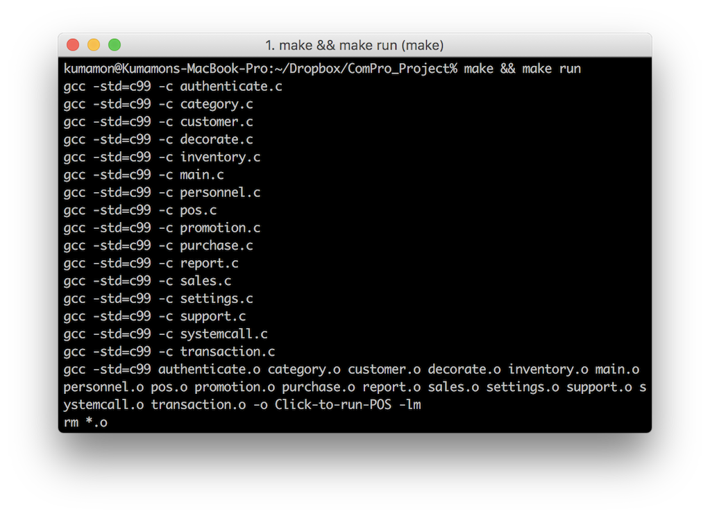
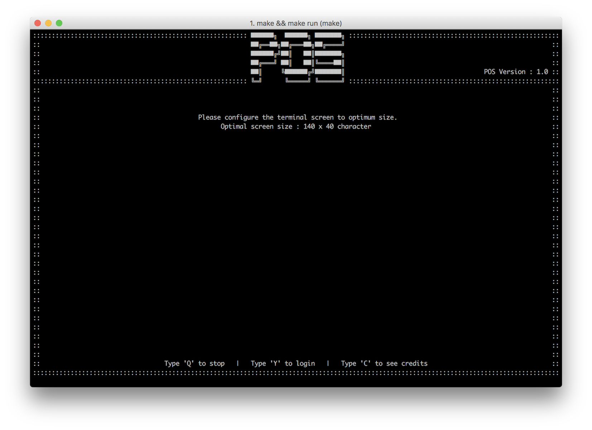
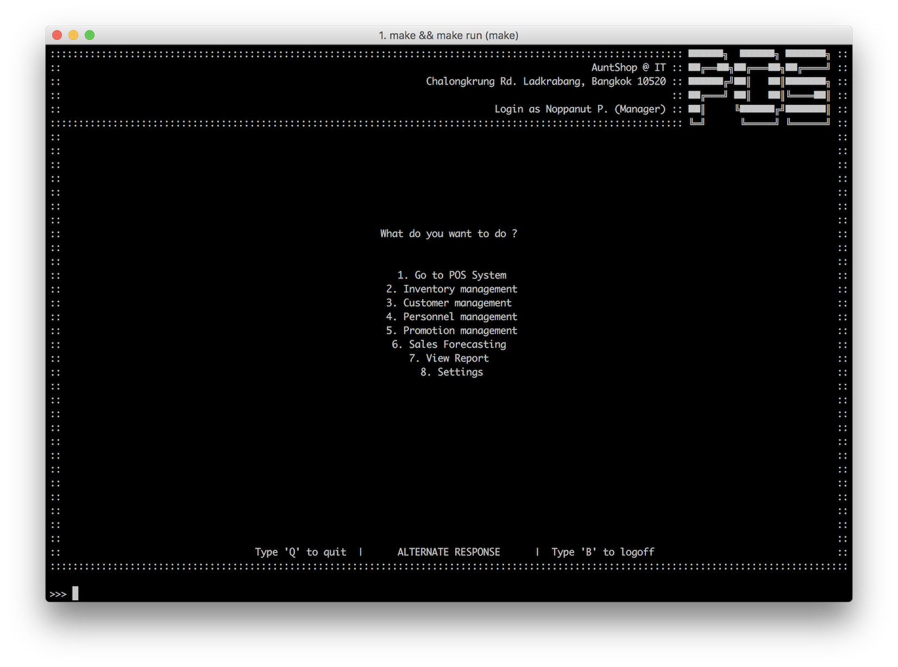
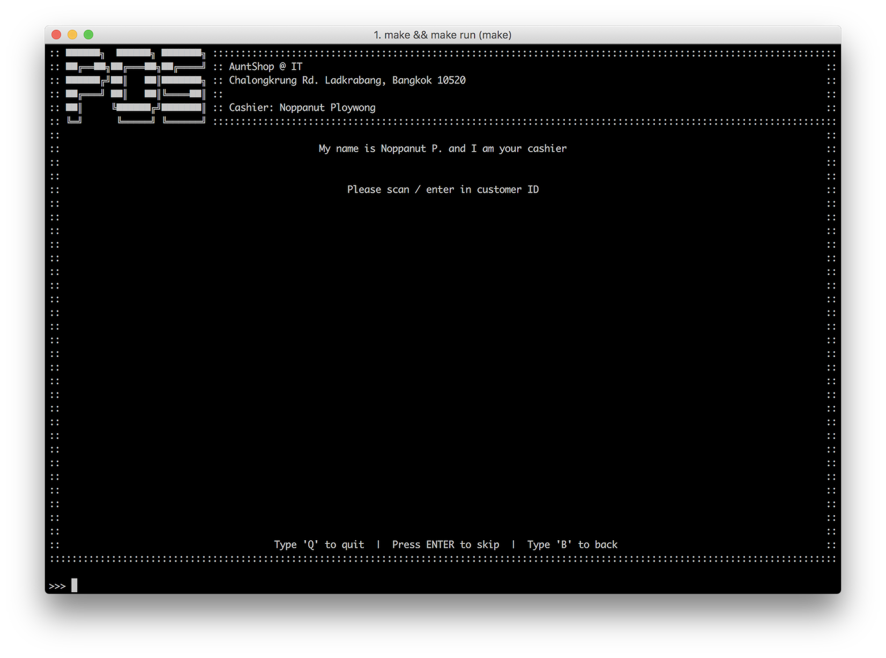
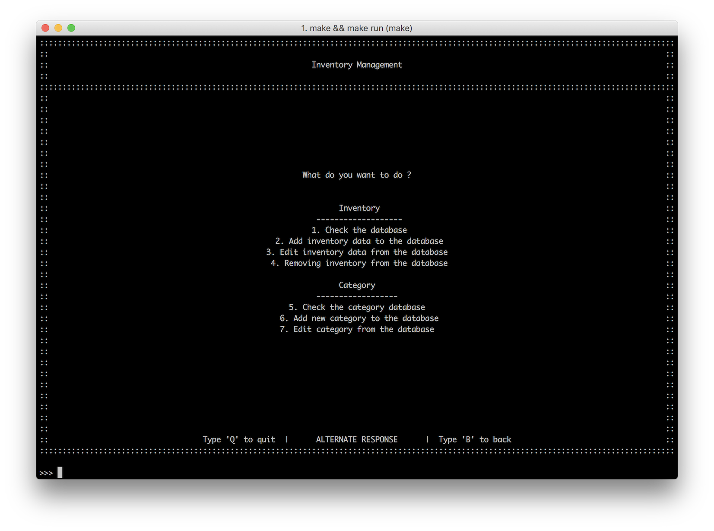
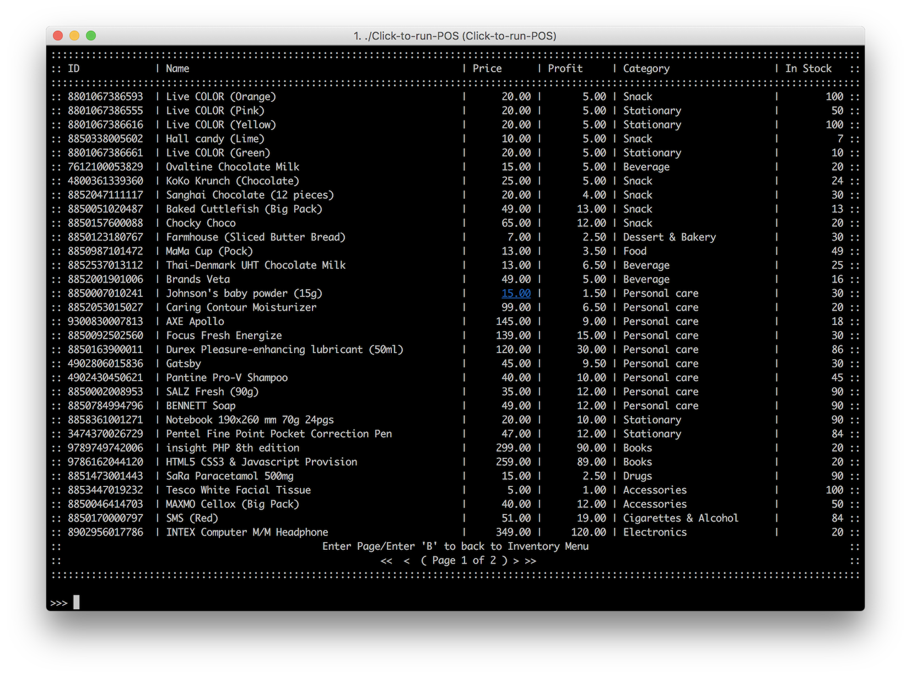
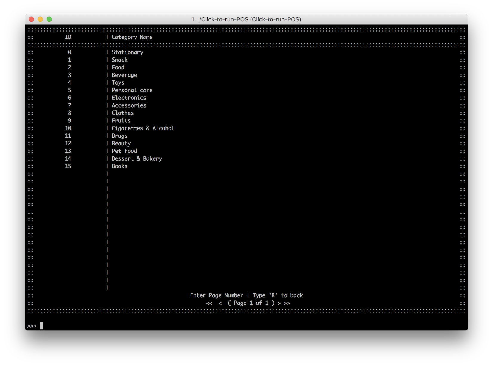
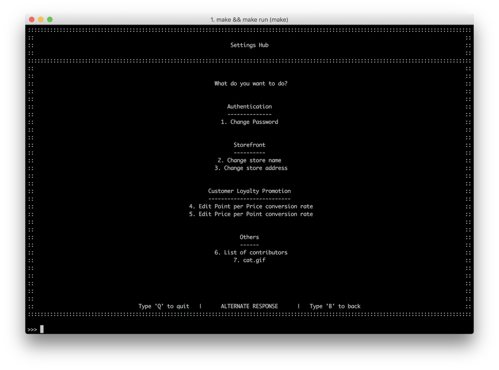
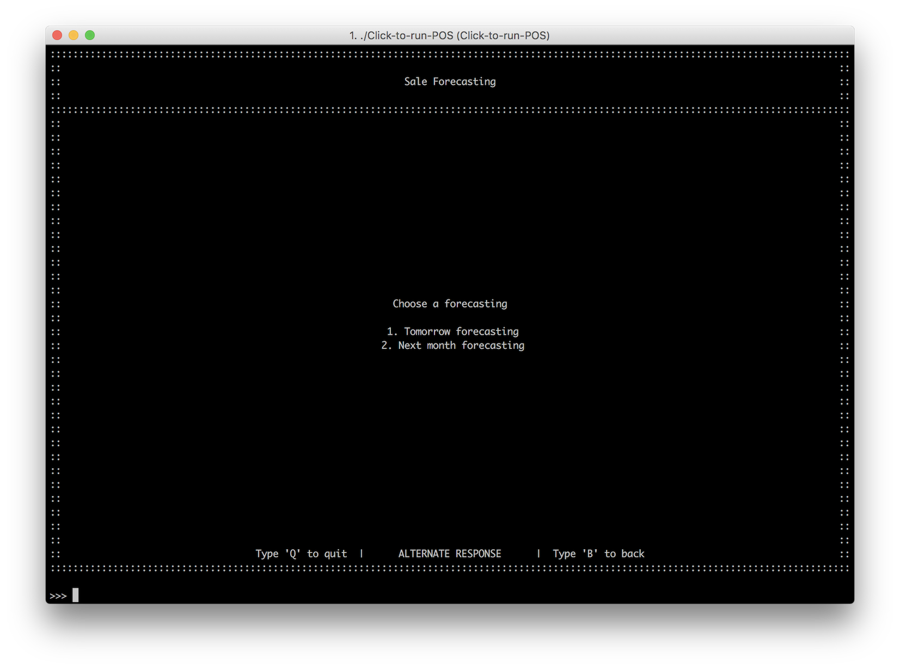

#  Introduction
สวัสดีครับ วันนี้กลุ่ม POS System เราได้สร้างโปรแกรมที่นำไปใช้กับเครื่องคิดเงิน (หรือที่เรียกว่า ระบบ Point of Sale) อย่างเต็มรูปแบบ และสามารถทำงานได้จริง และรองรับการทำงานได้ในหลายระบบปฎิบัติการที่สร้างขื้นจากระบบ UNIX โดยการใช้เพียงภาษา C ในการเขียน 100%

และสำหรับผู้ที่สนใจสถิติของโปรเจ็คนี้ หรือต้องการจะดาวน์โหลดโปรแกรมในรุ่นล่าสุด สามารถเข้าไปโหลดได้ที่ : https://github.com/sagelga/ComPro_Project/releases/

---

#  How to use
สำหรับวิธีการใช้งาน ให้ไปที่โฟล์เดอร์หลัก แล้วพิมพ์ `make && make run` ผ่าน Command Line เพื่อเป็นการ สร้างไฟล์ Executable (.exe) หลังจากนั้น โปรแกรมจะเปิดโปรแกรมขื้นมาให้ทันทีอัตโนมัติ สามารถใช้ระบบได้เลยทันที

---

#  Configurations
โปรแกรมของเรา จะรันได้อย่างราบรื่นมากที่สุดโดยผ่านการใช้ระบบปฏิบัติการ MacOS (OSX) เวอร์ชั่นล่าสุด และระบบปฏิบัติการที่มาจาก UNIX (UNIX-based OS) เช่น Linux Ubuntu

เราแนะนำให้ผู้ใช้ปรับความกว้างหน้าจอ Terminal เป็นขนาดอย่างน้อย 140 x 40 pixel

เนื่องจากว่าระบบของเราไม่รองรับหน้าจอขนาดเล็กกว่าที่เราได้กำหนดไว้

---

#  Log In
ก่อนที่จะใช้งานระบบ POS ลูกค้าจำเป็นที่จะต้อง login เพื่อจะเข้าระบบเสียก่อน โดยการเข้าระบบจากหน้าแรก (หน้าปรับขนาดหน้าจอ)​
1. ให้กด 'Y' แล้วกด ENTER
2. พิมพ์ username (หรือใช้ scanner เช่นตัวยิงบาร์โค้ด) เข้าไปที่ระบบ
3. พิมพ์ password ของผู้ใช้งาน (user) นั้น
4. ระบบจะเช็คหาถึงความถูกต้องของ username / password และนำผู้ใช้ไปที่หน้่าหลัก

ในการใช้ demo นี้ คุณสามารถใช้

`username : admin`
`password : admin`

เพื่อเข้าระบบได้

---

#  Feature Dashboard
สำหรับการใช้งานระบบ POS ก็จะมีระบบย่อยๆ ต่างๆ เพื่อช่วยในการขาย เช่น

|Inventory   เช็คสินค้าคงคลัง |Sales Settings   เช็คถึงยอดขาย|Forecast Settings   เช็คถึงยอดขายในอนาคต|Personnel Settings   เช็คผู้ใช้งานอื่น|Category Settings   เช็คประเภทของสินค้า Settings   |Promotion Settings   เปลี่ยนโปรโมชั่นสำหรับลูกค้า|Settings Settings   แก้ไขข้อมูลพื้นฐานของร้านค้า|

โดยทุกระบบที่ได้เกล่ามานั้น ผู้ใช้งานที่เป็น เจ้าของร้าน (ผู้ใช้งานระดับ admin) **สามารถเข้าไปปรับแก้ได้ และ สามารถเปลี่ยน/เพื่ม/ลด ได้ทั้งหมด**

---

#  Common Shortcut Keys
|Q|V|B|ENTER|1 - 9|
|-|-|-|-|-|
|**Quit** Sign Out และปิดโปรแกรม|**Void** ยกเลิกการทำการ   (เฉพาะในหน้า POS)|**Back** กลับไปหน้าก่อนหน้า   (หากไม่มีหน้าก่อนหน้าจะเป็นการ Sign Out)|**Continue** / **Skip** ทำงานต่อไป หรือ ให้ใช้ค่าเรื่มต้น  (แตกต่างกันในแต่ละหน้าจอ)|**Selection**   ตัวเลือกในหน้าจอ

---

#  How to use POS Sales System

|Step 1|Step 2|Step 3|Step 4|
|:-:|:-:|:-:|:-:|
|กรอก รหัสบัตรสมาชิก (หากไม่มี สามารถกด Skip ขั้นตอนนี้ได้) |สแกนสินค้าที่ต้องการจ่าย  (หากสินค้าที่สแกน ไม่ได้อยู่ในระบบ หรือของคงคลังหมด ระบบจะแจ้งว่าสินค้านั้นไม่สามารถจ่ายได้)|หากลูกค้าอยากใช้คะแนนเป็นส่วนลด หรือใช้ Voucher เงินสด ก็สามารถสแกนเข้าไปได้|ยอดการใช้จ่ายครั้งนี้ และ ยอดคะแนนสะสมของลูกค้า จะถูกแสดงในขั้นตอนนี้|

---

#  How to use Inventory Dashboard

|พิมพ์|เพื่อ|วิธีการใช้งาน|
|:-:|:---|----------|
|1|เช็คสินค้าคงคลัง|สามารถดูฐานข้อมูลได้ทันที  หากต้องการเปลี่ยนหน้าสามารถพิมพ์เลขหน้าที่อยากจะไปได้ในทันที|
|2|เพื่มรายการ|กรอกรายละเอียดของสินค้า  เช่นชื่อสินค้า รหัสบาร์โค้ด รายได้ที่จะได้รับ ราคา และปริมาณสินค้าคงคลัง โดยหลังจากเพื่มลงในระบบแล้ว ข้อมูลนี้จะเข้าไปอยู่ในฐานข้อมูลและสามารถใช้งานได้ทันที|
|3|เปลี่ยนข้อมูลในฐานข้อมูล|เปลี่ยนข้อมูลโดยการกรอกใหม่ทั้งหมด  หากไม่ต้องการเปลี่ยน สามารถใช้ข้อมูลเก่าได้|
|4|ลบสินค้าในฐานข้อมูล|ลบข้อมูลในฐานข้อมูล  โดยการพิมพ์รหัสสินค้า และกดยืนยัน หากยืนยันแล้ว ระบบจะลบข้อมูลของสินค้านั้นออก และไม่สามารถกู้กลับคืนได้|
|5|เช็คประเภทสินค้่า|สามารถดูฐานข้อมูลได้ทันที  หากต้องการเปลี่ยนหน้าสามารถพิมพ์เลขหน้าที่อยากจะไปได้ในทันที|
|6|เพื่มประเภทสืนค้า|เพื่มชื่อประเภทสินค้่าโดยการพิมพ์ชื่อประเภทที่เราต้องการ  (หากมีชื่อนั้นอยู่แล้ว จะไม่สามารถตั้งซ้ำได้)  และระบบจะสร้าง ไอดี เพื่อนำไปติดกับสินค้าได้|
|7|เปลี่ยนชื่อของประเภทสืนค้า|เปลี่ยนชื่อประเภทสินค้าโดยการพิมพ์ชื่อประเภทเก่าที่ต้องการเปลี่ยน และพิมพ์ชื่อใหม่เข้าไป ระบบจะเปลี่ยนชื่อในทันที (ไอดีจะคงเหมือนเดิม ดังนั้นระบบจะยังสามารถทำงานต่อได้อย่างปกติ)|

### Inventory Database Interface

### Category Database Interface

---

#  How to use Settings Dashboard

|พิมพ์|เพื่อ|วิธีการใช้งาน|
|:-:|---|----------|
|1|เปลี่ยนพาสเวิร์ด|สามารถเปลี่ยนรหัสเพื่อเข้าระบบของตนเองได้   โดยการกรอกรหัสเก่า แล้วจึงสามารถเปลี่ยนรหัสใหม่ได้ โดยต้องพิมพ์ยืนยันอีกครั้งหนึ่ง   (หากพิมพ์ยืนยันผิด จะต้องเข้าไปทำการแก้ใหม่อีกครั้งตั้งแต่แรก)|
|2|เปลี่ยนชื่อหน้าร้าน|ชื่อร้านจะปรากฎในหน้าแรก และ หน้าการชำระเงิน โดยสามารถแก้ได้โดยการพิมพ์ชื่อใหม่เข้าไปในระบบ|
|3|เปลี่ยนที่อยู่ร้าน|ที่อยู่ร้านจะปรากฎในหน้าแรก และ หน้าการชำระเงิน โดยสามารถแก้ได้โดยการพิมพ์ชื่อใหม่เข้าไปในระบบ|
|4|เปลี่ยนค่าคะแนนที่จะได้รับจากการใช้จ่าย|โดยที่ การใช้จ่ายทุกๆ x บาท จะได้ 1 คะแนน   โดยเจ้าของร้านสามารถแก้ไขค่า x ได้ และจะเรื่มใช้งานด้วยเรทใหม่กับการทำรายการหลังจากการเปลี่ยนเท่านั้น (ไม่แก้ไขย้อนหลัง)|
|5|เปลี่ยนค่าคะแนนเป็นส่วนสดเงินสด|โดยที่ การใช้ x คะแนน สามารถแลกเป็นส่วนลดได้ 1 บาท   โดยเจ้าของร้านสามารถแก้ไขค่า x ได้ และจะเรื่มใช้งานด้วยเรทใหม่กับการทำรายการหลังจากการเปลี่ยนเท่านั้น (ไม่แก้ไขย้อนหลัง)|

---

#  How to use Forecast Dashboard

|พิมพ์|เพื่อ|
|:-:|---|
|1|ดูการคาดเดารายวัน (ตามประเภทสินค้า)|
|2|ดูการคาดเดารายเดือน (ตามประเภทสินค้า)|

สำหรับวิธีการคาดคะเนนั้น ทางเราใช้ Exponential Smoothing ในการคาดเดา

Exponential Smoothing เป็นรูปแบบหนึ่งของการพยากรณ์ท่ีให้ความสําคัญกับข้อมูลเก่าทุกค่า โดยให้ความสําคัญแก่ค่าท่ีใกล้ปัจจุบันมากท่ีสุด ลดหลั่นลงไปจนถึงค่าที่ 1 และถ่วงน้ําหนักข้อมูล โดยใช้สัมประสิทธิ์การปรับเรียบ (alpha)

Sum of squared errors

Sum of squared errors (SSE) คือ การหาค่าความคลาดเคลื่อนของข้อมูลที่ได้จากการทำนาย กับข้อมูลที่เกิดขึ้นจริง

การพยากรณ์ยอดขายของระบบ

โปรแกรม Point of Sales (POS) Systems สามารถพยากรณ์ยอดขายให้ผู้ใช้ระบบ สามารถดูการพยากรณ์ยอดขายของวันถัดไป และเดือนถัดไปได้ โดยใช้หลักการของ Exponential Smoothing ร่วมกับค่า Sum of squared errors (SSE)

จากหลักการพยากรณ์ของ Exponential Smoothing จะต้องมีการเลือกค่าสัมประสิทธิ์การปรับเรียบ
(alpha) ที่เหมาะสม ซึ่งโปรแกรม POS จะทำการเลือกค่า  ที่เหมาะสมจากการคำนวนค่า Sum of squared errors โดยจะเลือกค่า alpha ที่มีค่า Sum of squared errors ที่น้อยที่สุด

### Daily Forecast Interface

---

#  Team Members
|  |ชื่อ|นามสกุล|GitHub Username|รหัสนักศึกษา|
|:-:|--|------|---------------|---------|
||Kunanon|Srisuntiroj|[@sagelga](https://github.com/sagelga)|59070022|
||Thanawat|Laodkaew|[@skydddoogg](https://github.com/skydddoogg)|59070071|
||Noppanut|Ploywong|[@noppanut15](https://github.com/noppanut15)|59070082|
||Vasanchai|Prakobkij|[@59070156](https://github.com/@59070156)|59070156|
||Weerakorn|Pongpum|[@fablemay](https://github.com/@fablemay)|59070163|

#  Assistant Teacher
|ผศ. ดร. กิติ์สุชาติ พสุภา|ผศ. ดร. ปานวิทย์ ธุวะนุติ|
|:-:|:-:|
|||

รายงานนี้เป็นส่วนหนึ่งของวิชา Computer Programming (รหัส 06016206)

คณะเทคโนโลยีสารสนเทศ สถาบันเทคโนโลยีพระจอมเกล้าเจ้าคุณทหารลาดกระบัง

---

#  Status Check
|   Travis-CI|   Travis-CI|
|:-:|:-:|
|Master   |Development   |
